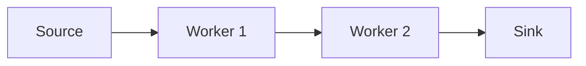

# Contributing to Web Learning

Thank you for your interest in contributing to the Web Learning documentation!
This guide will help you get started with contributing to this Docusaurus-based
project.

## Prerequisites

- Node.js 18+
- npm, yarn, or pnpm
- Git
- Basic knowledge of Markdown and MDX

## Development Setup

1. **Fork and Clone**:

   ```bash
   git clone https://github.com/YOUR_USERNAME/web-learning.git
   cd web-learning
   ```

2. **Install Dependencies**:

   ```bash
   make install
   ```

3. **Start Development Server**:

   ```bash
   make dev
   ```

4. **Verify Setup**:
   - Open `http://localhost:3000` in your browser
   - Changes should auto-reload as you edit

## Development Workflow

### Making Changes

1. **Create a Feature Branch**:

   ```bash
   git checkout -b feature/your-feature-name
   ```

2. **Make Your Changes**:
   - Edit documentation in `docs/`
   - Add new components to `src/components/`
   - Update navigation in `sidebars.ts` if needed

3. **Preview Changes**:

   ```bash
   make dev
   ```

4. **Run Quality Checks**:

   ```bash
   make check
   ```

5. **Fix Issues**:
   ```bash
   make fix
   ```

### Writing Documentation

#### Adding a New Page

1. Create a new `.mdx` file in the appropriate `docs/` subdirectory
2. Add the page to `sidebars.ts` navigation
3. Follow the existing content structure:

```mdx
import Callout from '@site/src/components/Callout';
import Question from '@site/src/components/Question';
import Expected from '@site/src/components/Expected';

# Your Page Title

Brief introduction paragraph.

## Main Content

Your technical content here.

<Callout type="good">This is a best practice example.</Callout>

<Question>How would you implement feature X?</Question>

<Expected>
  A good answer should include: - Key concept 1 - Key concept 2 - Specific
  implementation details
</Expected>

## Signals of Mastery

- Understands core concepts
- Can implement solutions
- Knows performance implications

## Red Flags

- Misunderstands fundamental concepts
- Ignores security considerations
- Uses outdated patterns
```

#### Adding Interview Questions

Each technical section should have a `q-questions.mdx` file with 10+ probing
questions. Format:

```mdx
# [Section] Interview Questions

<Question>Specific technical question that probes understanding?</Question>

<Expected>
  What a strong answer looks like: - Key point 1 - Key point 2 - Advanced
  consideration
</Expected>
```

#### Using Custom Components

- **`<Callout type="good|bad|note">`**: Highlight best practices, warnings, or
  important notes
- **`<Question>`**: Format interview questions consistently
- **`<Expected>`**: Show what good answers should include
- **`<Tabs>` and `<TabItem>`**: Show platform-specific examples (Node.js vs
  Browser)

#### Writing Mermaid Diagrams

Use Mermaid for architectural diagrams:

````markdown

````

### Code Examples

#### TypeScript/JavaScript

```typescript
// Prefer TypeScript examples with proper typing
interface WorkerMessage {
  type: 'process' | 'result';
  data: ArrayBuffer;
}

// Include both Node.js and browser versions when relevant
```

#### Rust (when relevant)

```rust
// Include Rust examples for WASM-related content
use wasm_bindgen::prelude::*;

#[wasm_bindgen]
pub fn process_data(input: &[u8]) -> Vec<u8> {
    // Implementation
}
```

## Content Guidelines

### Writing Style

- **Target Audience**: Senior developers and technical interviewers
- **Tone**: Professional, concise, practical
- **Length**: Aim for 80 characters per line in markdown
- **Examples**: Always include practical code examples
- **Depth**: Cover both basics and advanced edge cases

### Technical Standards

- **Accuracy**: All technical information must be current and correct
- **Completeness**: Cover common patterns, gotchas, and performance
  considerations
- **Practicality**: Focus on real-world scenarios and implementation details

### Assessment Focus

Each technical page should include:

1. **Teaching Content**: Core technical concepts
2. **Signals of Mastery**: What good understanding looks like
3. **Red Flags**: Common misconceptions and poor practices
4. **Interview Questions**: Probing questions with expected responses

## Quality Standards

### Before Committing

**MANDATORY** checks before every commit:

```bash
# Run all quality checks
make check

# Fix any issues
make fix

# Verify no trailing whitespace
make check-trailing-whitespace
```

### Commit Message Guidelines

Follow these strict guidelines:

- **No Claude as co-author**: Never add Claude in commit messages
- **No emojis**: Use plain text only
- **80 character limit**: Wrap both title and body at 80 characters
- **Clear descriptions**: Focus on "why" rather than "what"

Good examples:

```
Add SharedArrayBuffer security requirements documentation

Covers COOP/COEP headers, cross-origin isolation, and Node.js
differences. Includes interview questions and assessment criteria.
```

Bad examples:

```
✨ Add SharedArrayBuffer docs 🚀

Co-Authored-By: Claude <noreply@anthropic.com>
```

### Testing Documentation

When modifying:

1. **Mermaid diagrams**: Preview in development server
2. **Code examples**: Verify syntax and accuracy
3. **Links**: Check all internal and external links work
4. **Navigation**: Test sidebar navigation flows

## Pull Request Process

1. **Create PR**: Use the provided PR template
2. **Description**: Clearly describe changes and motivation
3. **Testing**: Confirm all quality checks pass
4. **Review**: Address feedback promptly
5. **Merge**: Squash commits when merging

### PR Checklist

- [ ] Added at least one interview question
- [ ] Included "signals of mastery" indicators
- [ ] All quality checks pass (`make check`)
- [ ] No trailing whitespaces (`make check-trailing-whitespace`)
- [ ] Documentation builds successfully (`make build`)
- [ ] Links and navigation work correctly

## Claude Development Guidelines

When working with Claude Code to develop this project:

### Formatting Commands

After making code modifications, run appropriate formatting commands:

#### Markdown and MDX Files

- **Format**: Run `make format-md` after modifying markdown/MDX files
- **Check**: Run `make check-md` to verify formatting

#### TypeScript and JavaScript Files

- **Format**: Run `make format` after modifying TypeScript/JS files
- **Check**: Run `make check-format` to verify formatting

### Commit Guidelines

**NEVER** add Claude as a co-author in commit messages.

**NEVER** use emojis in commit messages.

**Always** wrap commit message titles and body text at 80 characters.

### Development Workflow

1. Make code changes
2. Run appropriate formatting command
3. **Always run `make fix-trailing-whitespace` before committing**
4. Verify formatting
5. **Verify no Claude co-author in commit message**
6. **Verify no emojis in commit message**
7. Proceed with testing or committing

### Critical Pre-Commit Requirements

- **MANDATORY**: Run `make fix-trailing-whitespace`
- **MANDATORY**: Run `make check-trailing-whitespace`
- Apply to ALL file modifications
- No trailing whitespaces allowed

## Getting Help

If you need help:

1. Check existing documentation and examples
2. Review the [Docusaurus documentation](https://docusaurus.io/docs)
3. Open an issue with specific questions
4. Join project discussions

## Recognition

Contributors will be recognized in:

- Project documentation
- Release notes
- Community acknowledgments

Thank you for helping make Web Learning a valuable resource for the community!
