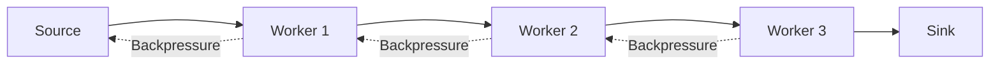

import Tabs from '@theme/Tabs';
import TabItem from '@theme/TabItem';
import Callout from '@site/src/components/Callout';
import Question from '@site/src/components/Question';
import Expected from '@site/src/components/Expected';

# MessagePort & Transferable Objects

MessagePort and MessageChannel provide a powerful abstraction for bidirectional
communication, while transferable objects enable zero-copy data transfer
between contexts.

## MessageChannel Basics

```typescript
// Main thread
const channel = new MessageChannel();
const { port1, port2 } = channel;

// Keep port1, send port2 to worker
worker.postMessage({ type: 'init', port: port2 }, [port2]);

// Listen on port1
port1.onmessage = ({ data }) => {
  console.log('Received from worker:', data);
};
```

<Tabs groupId="platform">
<TabItem value="browser" label="Browser">

```typescript
// Worker thread
let workerPort: MessagePort;

self.onmessage = ({ data }) => {
  if (data.type === 'init') {
    workerPort = data.port;

    // Now worker can communicate directly
    workerPort.postMessage('Worker initialized');

    workerPort.onmessage = ({ data }) => {
      // Handle messages from main thread
      processMessage(data);
    };
  }
};
```

</TabItem>
<TabItem value="node" label="Node.js">

```typescript
import { Worker, MessageChannel, isMainThread } from 'worker_threads';

if (isMainThread) {
  const { port1, port2 } = new MessageChannel();
  const worker = new Worker(__filename, {
    transferList: [port2],
    workerData: { port: port2 }
  });

  port1.on('message', (data) => {
    console.log('Received:', data);
  });
} else {
  const { port } = require('worker_threads').workerData;
  port.postMessage('Hello from worker');
}
```

</TabItem>
</Tabs>

## Transferable Objects

### ArrayBuffer Transfer

```typescript
// Create large buffer
const buffer = new ArrayBuffer(1024 * 1024); // 1MB
const view = new Uint8Array(buffer);

// Fill with data
for (let i = 0; i < view.length; i++) {
  view[i] = i % 256;
}

// Transfer to worker (zero-copy!)
worker.postMessage({
  type: 'process',
  buffer: buffer
}, [buffer]); // Transfer list

// ⚠️ buffer is now neutered (unusable) in main thread
console.log(buffer.byteLength); // 0
```

<Callout type="good" title="Zero-Copy Performance">
Transferring ArrayBuffers moves ownership instead of copying data, enabling
efficient processing of large datasets without memory duplication.
</Callout>

### ImageData Transfer

```typescript
// Canvas processing with transferable ImageData
const canvas = document.createElement('canvas');
const ctx = canvas.getContext('2d')!;
canvas.width = 1920;
canvas.height = 1080;

// Get image data
const imageData = ctx.getImageData(0, 0, canvas.width, canvas.height);

// Transfer for processing
worker.postMessage({
  type: 'processImage',
  imageData: imageData
}, [imageData.data.buffer]);

// Worker processes and returns
worker.onmessage = ({ data }) => {
  if (data.type === 'imageProcessed') {
    const processedImageData = new ImageData(
      new Uint8ClampedArray(data.buffer),
      canvas.width,
      canvas.height
    );
    ctx.putImageData(processedImageData, 0, 0);
  }
};
```

## Backpressure Patterns

### Credit-Based Flow Control

```typescript
class BackpressureController {
  private credits = 10; // Max outstanding operations
  private pendingWork: Array<() => void> = [];

  async processWithBackpressure<T>(
    data: T,
    processor: (data: T) => Promise<void>
  ): Promise<void> {
    return new Promise((resolve) => {
      const work = async () => {
        this.credits--;
        try {
          await processor(data);
        } finally {
          this.credits++;
          this.processNext();
          resolve();
        }
      };

      if (this.credits > 0) {
        work();
      } else {
        this.pendingWork.push(work);
      }
    });
  }

  private processNext(): void {
    if (this.credits > 0 && this.pendingWork.length > 0) {
      const work = this.pendingWork.shift()!;
      work();
    }
  }
}
```

### Bounded Queue Implementation

```typescript
class BoundedMessageQueue<T> {
  private queue: T[] = [];
  private waitingConsumers: Array<(value: T) => void> = [];
  private waitingProducers: Array<() => void> = [];

  constructor(private maxSize: number) {}

  async put(item: T): Promise<void> {
    if (this.waitingConsumers.length > 0) {
      // Direct handoff to waiting consumer
      const consumer = this.waitingConsumers.shift()!;
      consumer(item);
      return;
    }

    if (this.queue.length >= this.maxSize) {
      // Queue is full, wait for space
      await new Promise<void>(resolve => {
        this.waitingProducers.push(resolve);
      });
    }

    this.queue.push(item);
  }

  async take(): Promise<T> {
    if (this.queue.length > 0) {
      const item = this.queue.shift()!;

      // Notify waiting producer
      if (this.waitingProducers.length > 0) {
        const producer = this.waitingProducers.shift()!;
        producer();
      }

      return item;
    }

    // Queue is empty, wait for item
    return new Promise<T>(resolve => {
      this.waitingConsumers.push(resolve);
    });
  }
}
```

## Advanced Patterns

### Pipeline with MessagePorts



```typescript
class WorkerPipeline {
  private stages: Worker[] = [];
  private channels: MessageChannel[] = [];

  constructor(workerScripts: string[]) {
    // Create workers and channels
    for (let i = 0; i < workerScripts.length; i++) {
      this.stages[i] = new Worker(workerScripts[i]);

      if (i < workerScripts.length - 1) {
        this.channels[i] = new MessageChannel();

        // Connect current worker output to next worker input
        this.stages[i].postMessage({
          type: 'connect_output',
          port: this.channels[i].port1
        }, [this.channels[i].port1]);

        this.stages[i + 1].postMessage({
          type: 'connect_input',
          port: this.channels[i].port2
        }, [this.channels[i].port2]);
      }
    }
  }

  process(data: any): Promise<any> {
    return new Promise((resolve) => {
      // Send to first stage
      this.stages[0].postMessage({
        type: 'process',
        data,
        requestId: Math.random()
      });

      // Listen for result from last stage
      this.stages[this.stages.length - 1].onmessage = ({ data }) => {
        if (data.type === 'result') {
          resolve(data.result);
        }
      };
    });
  }
}
```

## Performance Optimization

### Batch Transfer Strategy

```typescript
class BatchTransferManager {
  private batch: ArrayBuffer[] = [];
  private batchSize = 10;
  private transferCallback: (buffers: ArrayBuffer[]) => void;

  constructor(callback: (buffers: ArrayBuffer[]) => void) {
    this.transferCallback = callback;
  }

  addBuffer(buffer: ArrayBuffer): void {
    this.batch.push(buffer);

    if (this.batch.length >= this.batchSize) {
      this.flush();
    }
  }

  flush(): void {
    if (this.batch.length === 0) return;

    const transferList = this.batch.slice();
    this.transferCallback(transferList);
    this.batch = [];
  }
}
```

<Question>
How would you implement backpressure in a worker pipeline where each stage has
different processing speeds?
</Question>

<Expected>
Strong candidates should mention:

- **Credit-based flow control**: Each stage maintains credits representing
  processing capacity
- **Bounded queues**: Limited buffer sizes between stages with blocking when
  full
- **Adaptive batching**: Adjust batch sizes based on downstream capacity
- **Monitoring and metrics**: Track queue depths and processing rates
- **Circuit breaker pattern**: Temporarily halt input when downstream is
  overwhelmed

They should also understand the trade-offs between throughput, latency, and
memory usage.
</Expected>

## Common Patterns

<Callout type="good">
Use MessagePorts for complex bidirectional communication patterns, especially
when you need to establish multiple independent communication channels.
</Callout>

<Callout type="bad">
Don't transfer the same ArrayBuffer multiple times - it becomes neutered after
the first transfer. Clone the data if multiple recipients need it.
</Callout>

## Signals of Mastery

- Understands zero-copy benefits of transferable objects
- Can implement backpressure mechanisms
- Knows when to use MessagePorts vs direct worker messaging
- Handles transferable object lifecycle correctly
- Implements efficient batching strategies

## Red Flags

- Tries to use ArrayBuffer after transferring it
- Doesn't consider backpressure in high-throughput scenarios
- Uses inefficient polling instead of event-driven communication
- Creates memory leaks by not cleaning up MessagePorts
- Blocks main thread waiting for worker responses